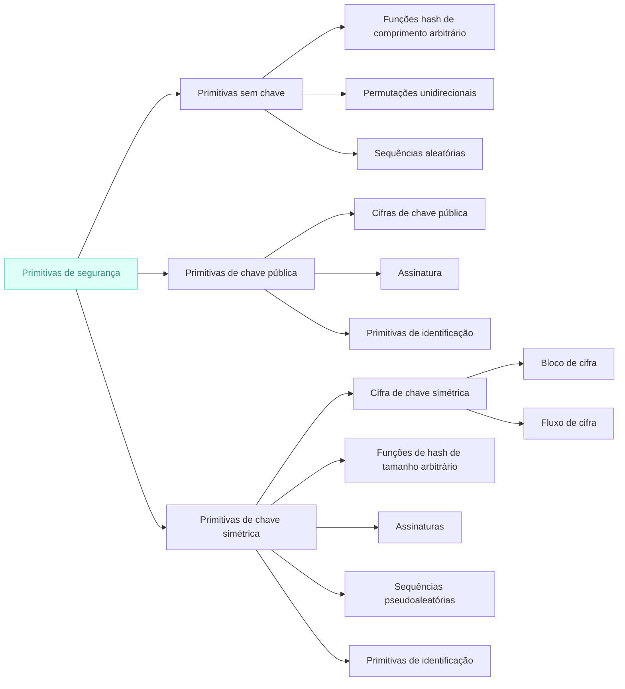

#Criptografia

```mermaid
flowchart LR
n2["Primitivas de segurança"]:::Aqua --> n4["Primitivas de chave pública"]
n2 --> n5["Primitivas de chave simétrica"]
n2 --> n6["Primitivas sem chave"]

n6 --> n7["Funções hash de comprimento arbitrário"]
n6 --> n16["Permutações unidirecionais"]
n6 --> n17["Sequências aleatórias"]

n4 --> n8["Cifras de chave pública"]
n4 --> n9["Assinatura"]
n4 --> n10["Primitivas de identificação"]

n5 --> n11["Cifra de chave simétrica"]
n5 --> n12["Funções de hash de tamanho arbitrário"]
n5 --> n13["Assinaturas"]
n5 --> n14["Sequências pseudoaleatórias"]
n5 --> n15["Primitivas de identificação"]

n11 --> n18["Bloco de cifra"]
n11 --> n19["Fluxo de cifra"]

classDef Aqua stroke-width:1px, stroke-dasharray:none, stroke:#46EDC8, fill:#DEFFF8, color:#378E7A;

```